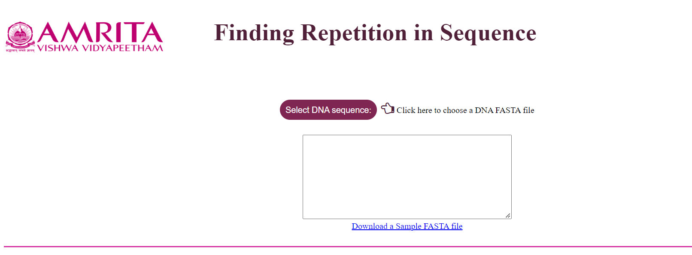
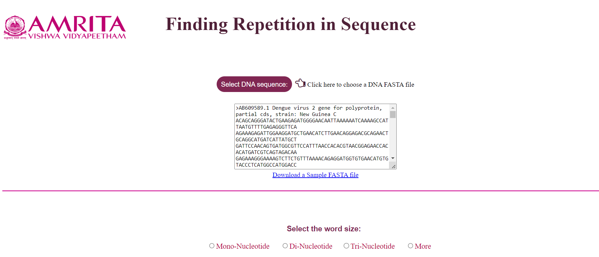
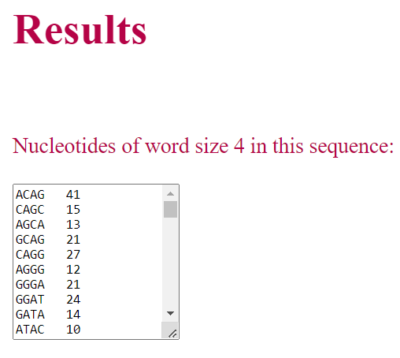

1.	User can either provide the DNA sequence in the given text box or download the given FASTA file. Save the file in Personal Computer and use the sequence for completing the experiment.

 
2.	In the protocol, the sample FASTA file provided in the GUI is used for explaining the steps.

3.	When user selects the DNA sequence, the details of the sequence are displayed in the textbox.

 
&nbsp;

### Understanding the GUI

•	User can chose the appropriate word size for working the simulator.

•	If user select Mono-nucleotide, and click on Submit button, count for A, T, G and C in the sequence is displayed as result. 

 

•	Similarly, if the user select di-nucleotide or tri-nucleotide, corresponding number of nucleotides in the sequence are displayed as result.

•	If the user clicks on option “More”, user have to provide the word count of their specific interest in the text box provided. User can give either as 4, 5, 6 and so on so that the number of nucleotides in that count will be displayed as result. 

•	For understanding the restriction enzyme site, user can choose specific restriction enzymes and the result window will display (highlight) the specific site for restriction digestion in the given sequence. 

•	If user selects EcoR1 as the restriction enzyme, specific enzyme site ‘ GAATTC’ in the sequence is identified and the user can calculate the number of restriction site by enzyme EcoR1. 

 

•	If user selects HindIII as the restriction enzyme, specific enzyme site ‘ AAGCTT’ in the sequence is identified and the user can calculate the number of restriction site by enzyme HindIII. 
 

•	If user selects BamH1 as the restriction enzyme, specific enzyme site ‘ GGATCC’ in the sequence is identified and the user can calculate the number of restriction site by enzyme BamH1. 

 

•	In the Enter the word to search option in the simulator, user can give a short nucleotide sequence and the result will display number of times that short sequence get repeat in the given FASTA file DNA sequence. For example, provide the short sequence as AAAA

 
 

 
 

