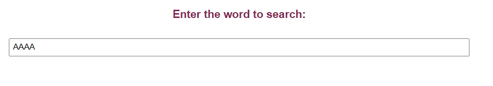

1.	User can upload a DNA sequence in FASTA file. A sample file is also provided which can be saved in the Personal Computer  as .txt file and use the sequence for completing the experiment. The figures are based on this sample file

 
2. When the user selects the DNA sequence, the details of the sequence are displayed in the textbox and the other options are visible which requires user input

 
&nbsp;

### Understanding the GUI

•	User can chose the a word size which will cut the sequence into different words and on submitting, the results displays the different wors as well as their occurances.

  •	If user select **Mono-nucleotide**, and click on **Submit** button, count for A, T, G and C in the sequence is displayed as result. 
 

 

 

  •	Similarly, if the user select di-nucleotide or tri-nucleotide, corresponding words present in the sequence and their occurances are displayed as result.
 

 

  •	If the user clicks on option **More**, user have to provide the word count of their specific interest in the text box provided. User can give either as 4, 5, 6 and so on with a max length as the length of the sequence provided. 
 

•	For checking if a restriction enzyme site is present, user can choose specific restriction enzymes and the result window will display (highlight) the specific site for restriction digestion in the given sequence. 
 

 

  •	If user selects EcoR1 as the restriction enzyme, specific enzyme site ‘ GAATTC’ in the sequence is identified and the user can calculate the number of restriction site by enzyme EcoR1. 
 

 

  •	If user selects HindIII as the restriction enzyme, specific enzyme site ‘ AAGCTT’ in the sequence is identified and the user can calculate the number of restriction site by enzyme HindIII. 

  •	If user selects BamH1 as the restriction enzyme, specific enzyme site ‘ GGATCC’ in the sequence is identified and the user can calculate the number of restriction site by enzyme BamH1. 

 
 
  •	If a restriction enzyme is not present, a notification saying the site is not present is also displayed
 
 

 

•	The user can also search for a particular word (short nucleotide sequence) by providing the word in the **Enter the word to search** option in the simulator. Result will display the number of times that short sequence get repeat in the given FASTA file DNA sequence. For example, provide the short sequence as AAAA
 

 

 
 
  If the short sequence is not present , a notification saying the word is not present is also displayed
 

•	The user can click on **Reset** button to reset the simulator window back to step 1.

 

