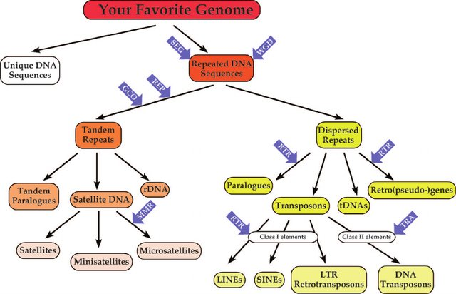
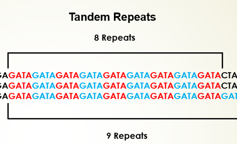

### Introduction

Analyzing genetic diversity and relationships between species and populations has a major role in molecular and genetic research studies. With the recent trends in the whole-genome sequencing, molecular markers of DNA are of greater interest in characterizing wide range of genomes in molecular species.  In this decade, advances in Bioinformatics research including Next-generation sequencing (NGS) has increased the efficiency of human genome sequencing in many folds. Even though, such methods are promising for DNA sequencing, there are challenges such as presence of repetitive DNA sequences that needs to be examined by scientific community to study genome function in detail. In computational aspect, DNA repeat creates problems in sequence alignment which may lead to biases in result interpretation and highlighting the need different strategies for solving the problems by bioinformatics systems  

&nbsp;

### Theory

As discussed in the experiment [Composition of DNA Sequence](https://virtual-labs.github.io/exp-sequence-composition-au), structure of DNA is a double-stranded helix connected by means of hydrogen bonds. In account of Chargaff’s rule, the bases Adenine pairs with Thymine and Guanine pairs with Cytosine. The double helical structure of DNA are anti-parallel in nature where 5’ terminus of one strand of DNA get paired with the 3' end of its complementary strand. Nucleotides are linked by phosphate groups that bind 3' end of one sugar to the 5' end of the next sugar. Under a specific temperature, dissociation happens to the two strands of DNA helix and form single stranded molecules. The process is known as DNA melting or named as thermal denaturation of DNA. Thermal denaturation of DNA is directly related to the absorbance of DNA at 260nm. The temperature at which half of the double helical DNA converted to single stranded is called melting temperature (Tm) of that specific DNA sequence. The presence of triple bonding between Guanine and Cytosine accounts for the stability of GC pairs when compared to double bonded Adenine and Thymine bases. Upon cooling the DNA strands, association of single strands to double stranded DNA was restored, which is termed as renaturation or reannealing of DNA.  In 1967, R. J. Britten and D. E. Kohne studied kinetics of renaturation of DNA and discovered repeated DNA sequences.

Repetitive DNA sequences are those DNA fragments that occur as multiple copies in the genome of a cell. In short, the repetitive DNA sequences have identical sequences of nitrogenous bases that are repeated several times and clustered together. Fast annealing kinetics may result in highly repetitious DNA,intermediate reannealing produce moderately repetitious DNA whereas slow annealing resulted in unique or single copy fraction of DNA segments. Repetitive DNA sequences are common in prokaryotes to eukaryotes to mammals covering half proportion of human genome. 

Briefly, repetitive sequences are very short sequences usually present in greater than 105 to several copies per genome. These are noncoding (do not code for protein) DNA sequence (junk DNA) stretches that are located between the genes in intergenic regions and thought to have regulatory functions. These repeated sequences have different shapes and sizes with specific functions in gene evolution. Interspersed repeats are repeated sequences, where the copies are nonadjacent and dispersed throughout the genome. Such repeats are common in eukaryotic genomes usually expressed as short interspersed nuclear elements (SINEs), with 100 to 700 base pairs in length and long interspersed nuclear elements (LINEs), with 7,000bps in length.  Examples include DNA transposons and retrotransposons. Tandem repeats or nested repeats have copies of sequence that are repeated one after another along a chromosome and the repeats are seen adjacent to each other. It has just two copies or millions of copies ranging size from 1–2 bases (mono- and dinucleotide repeats) to millions of bases. One of the salient features of this short tandem repeats is higher variability in length of these sequences featured by the insertion and/or deletion of base units that may affect the replication and DNA repair process. 

Fig. 1. Repeated DNA sequences in eukaryotic genomes and its evolution
    
Image source :https://www.researchgate.net/publication/23567269_Comparative_Genomics_and_Molecular_Dynamics_of_DNA_Repeats_in_Eukaryotes/figures?lo=1
 

An example for tandem repeat sequence is, TATATATA, where the base unit TA is repeated four times. Depending on the length of the repeated base units and array size, the tandem repeats of DNA are classified into several groups. Satellite DNA sequences are portion of DNA sequences that are tandemly-arrayed, non-coding nucleotides which are highly-repetitive with highly-conserved monomer sequences. The length of the monomer sequence is 150–400 base pairs (bp), fast-evolving and abundant in eukaryotic organisms with features specific to species or genome. It plays a major role in functioning of centromere and formation of heterochromatin. Microsatellites are tandem repeats containing 2 to 5 bp repeat s, that is short tandem repeats (STRs) or simple sequence repeats (SSRs) with array size in 10–100 units order and repeated about five to fifty times in a sequence. Repeating DNA sequences of length 10- to 100-bp and array size usually of 0.5–30 kb are known as minisatellites. Such DNA motifs repeats 5-50 times and occur at 1000+ locations in human genome with higher probability range for mutation and diversity in nuclear genome. Variable number tandem repeats (VNTRs) are tandem DNA repeats with 15 to 100 bp length. Another examples of tandem repeats are mononucleotide repeats (a single nucleotide), dinucleotide (two nucleotides), tri-, tetra-, and pentanucleotides (three, four and five nucleotides) which are STRs present at any site of the genome. These repetitive DNA sequences have wide range of applications in DNA fingerprinting. Conserving the repetitive DNA sequences due to its higher variability and identifying novel repetitive sequences still poses challenges in biological research.
&nbsp;

 Fig.2. Example of a repetitive DNA sequence in a genome. In tandem repeats the repetitive nucleotide sequence is adjacent to each other, forming an array. 
Image source : https://pediaa.com/difference-between-repetitive-dna-and-satellite-dna/  

#### Restriction Endonucleases

Restriction endonucleases are enzymes produced by bacteria, which are sequence specific and cleave double-stranded DNA at specific sites called recognition sites. It recognizes short specific sequences of ATGC bases, known as recognition sequences, which are distributed randomly in a DNA molecule. Restriction enzymes are termed as "molecular scissors" hydrolyzing the hydrogen bond between the specific nucleotides and cuts the DNA at specific point. Type I restriction enzymes cut DNA far from the recognition sequences whereas Type II enzymes cut DNA at specific positions of the recognition sequences. Type III enzymes cleaves DNA outside of the recognition sequences and Type IV enzymes works on methylated DNA sequences that are most common in E.coli McrBC and Mrr systems. 

#### Examples

    •	EcoRI, a type II restriction enzymes, from Escherichia coli, which recognizes the palindrome sequence of DNA  5' GAATTC 3' and 3' CTTAAG  5'. It cleaves DNA at G and A on both strands and form four strings of nucleotides with sticky ends.

    •	HindIII, type II site-specific deoxyribonuclease restriction enzymes, isolated from the Haemophilus influenza that cleaves DNA palindromic sequences.  Mg2+ act as cofactor for the enzyme action. The specific sequence of HindIII enzyme is 5’AACCTT3′ and its palindrome 3’TTCGAA5′. It cleaves between AAs and forms 5′ overhangs on the DNA with sticky ends.

    •	BamHI is a type II restriction endonuclease, isolated from Bacillus amyloliquefaciens recognizes short sequences of DNA and cleave at specific target site 5’-GGATCC-3' and palindrome 3' CCTAGG 5' and cleaves at 5'-guanine on each strand forming sticky ends.

    •	PvuI, restriction endonuclease isolated from Proteus vulgaris that cleaves DNA at the recognition sequence 5′-CGATCG-3′ and palindrome 3'-GCTAGC-5′ forming DNA fragments with 3′-cohesive termini

&nbsp;

### Pedagogical Aspects

1.	User can study and identify repetitive DNA sequence with a user-interactive platform.

2.	User can identify specific recognition sites of restriction endonucleases and its action computationally.

&nbsp;

&nbsp;

### Algorithm to develop a simulator which could find repetitive sequences
&nbsp;

**Step 1: Problem Definition:**

To identify the repetitive sequences as well as the restriction sites and their occurances present in a given DNA. 

&nbsp;

**Step 2: Project Planning & System Definition:**

The pedagogical features of this simulator are, the user can determine the presence of repeating DNA sequences in a DNA strand and compute their number, the action of restriction endonucleases and their specific recognition sites are computationally recognized by the user.

&nbsp;

**Step 3: Model Formulation:**

1. Get a DNA sequence in FASTA format.

    Eg: >CG891703.1 Ygmt330P6 Yunnan snub-nosed monkey genomic BAC library Rhinopithecus bieti genomic clone 330P6, genomic survey sequence

    TTTCTGCCAGGACTCTTGATGATGTGCGGTTTGCTTTCAGGGATAGGAAGATAAAAACGCTAAAAGAAGA
    CAAAAATATTAACACAATAATAAAAAAAAAAAGCCAGAAAAAATAGTAGTTTTTCAAGAACACTTCAGAA
    TCCTGATACTTTACATGAACCAAGAAATATAGACATAAAAAAGAGACACACACCTGTAAGGAGAGATGAG
    ACACAGGACTGGGTTACTTTTGATGAAGAGGCTTCTTACCAGTTACAACTGAAGTGAGTAAGAAGAAATT
    AGCTACTTTTTTCAAGATCTGTGGTAGATAAAATGTAGGTCAGTTTGAGTCTGAAATAAATGGAGGAGTG
    AAATACAGAAGTACAGGGATAGAGAGACAGAACATAAATCTAAGTTACCAACATCAGGAATAAAAAAGAG
    GACATTAATACAGACAGAAATTATGAATATCAGAATATAATAGATGTTATGAACAATTCTTTAGCACTAA
    TTTTGACACTTTAATGAAGTGGACAAAATAGTTAACACACACACACACACAACTTATCA

2. Split the sequence using line break.

    Eg: 
    
    Line:1- CG891703.1 Ygmt330P6 Yunnan snub-nosed monkey genomic BAC library Rhinopithecus bieti genomic clone 330P6, genomic survey sequence

    Line:2- TTTCTGCCAGGACTCTTGATGATGTGCGGTTTGCTTTCAGGGATAGGAAGATA
    AAAACGCTAAAAGAAGA

    Line:3- CAAAAATATTAACACAATAATAAAAAAAAAAAGCCAGAAAAAATAGTAGTTTTTCAAGAACACTTCAGAA     Etc.

3. Remove the first line.

    Eg:

    Line:1- TTTCTGCCAGGACTCTTGATGATGTGCGGTTTGCTTTCAGGGATAGGAAGATA
    AAAACGCTAAAAGAAGA

    Line:2- CAAAAATATTAACACAATAATAAAAAAAAAAAGCCAGAAAAAATAGTAGTTTTTCAAGAACACTTCAGAA     Etc.
    

4. Join the entire sequence.

    Eg:
    TTTCTGCCAGGACTCTTGATGATGTGCGGTTTGCTTTCAGGGATAGGAAGATAAAAACGCTAAAAGAAGACAAAAATATTAACACAATAATAAAAAAAAAAAGCCAGAAAAAATAGTAGTTTTTCAAGAACACTTCAGAATCCTGATACTTTACATGAACCAAGAAATATAGACATAAAAAAGAGACACACACCTGTAAGGAGAGATGAGACACAGGACTGGGTTACTTTTGATGAAGAGGCTTCTTACCAGTTACAACTGAAGTGAGTAAGAAGAAATTAGCTACTTTTTTCAAGATCTGTGGTAGATAAAATGTAGGTCAGTTTGAGTCTGAAATAAATGGAGGAGTGAAATACAGAAGTACAGGGATAGAGAGACAGAACATAAATCTAAGTTACCAACATCAGGAATAAAAAAGAGGACATTAATACAGACAGAAATTATGAATATCAGAATATAATAGATGTTATGAACAATTCTTTAGCACTAATTTTGACACTTTAATGAAGTGGACAAAATAGTTAACACACACACACACACAACTTATCA
    

5. If mononucleotide is checked, then count each nucleotide from the string.

    Eg:

    A   1131

    C   684

    G   853

    T   734

  If dinucleotide is checked, first find out the possible dinucleotide present in the Array_1 and count each dinucleotide present in the string.

    Eg:

    AC   247

    CA   322

    AG   282

    GC   144……..

  For trinucleotide, find the possible trinucleotide present in the Array_1 and count each trinucleotide present in the string.

    Eg:

    ACA   118

    CAG   91

    AGC   44

    GCA   52…

  For more, user can give the word size and make possible words with the user given word size with the Array_1 and count how many times the word repeated in the string.
  

6. Finding restriction enzyme site, find out how many times each restriction enzyme site (GAATTC) is repeated in the string and count the repetition and highlight the sites.

  Eg:

  The total number restriction site of EcoRI (GAATTC) in this sequence: 2

  GCAATCTATGGGGCTGCCT**GAATTC**TCAGTGGGGTCTCATGGACTATGAAAATCCTCATAGGAGTCATTATCACATGGATAGGAATACGCAGCACCTCACTGTCTGTGTCACTAGTATTGGTGGGA**GAATTC**GTCGTGACGCTGTATTTGGGAGTTATG
  
 
7. If the restriction site is not present in the string, then print “The Restriction site is not present in this sequence”.

    Eg:

    The Restriction site of EcorI is not present in this sequence.

8. For word to search, user can give the word and count how many times the word repeated in the string using the regular expression ‘match’. Print it.

    Eg:

    GATG = 22

    If the word is not present in the string, then print "The word is not present in the sequence”.

    Eg:

    TTGGCCAA is not present in the sequence.

